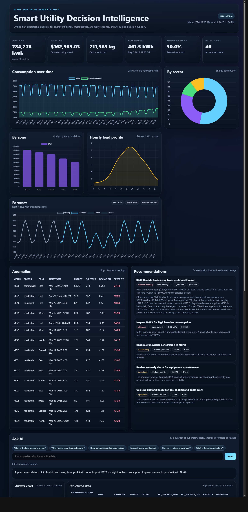

# Smart Utility Decision Intelligence Platform

An AI-powered **Decision Intelligence Platform for Energy Efficiency & Smart Utilities**. It turns raw smart-meter data into insights, anomaly alerts, forecasts, and quantified recommendations — and lets you ask questions in natural language.

Built for the *"AI for Better Living and Smarter Communities"* challenge. It runs **fully offline by default** (no cloud account needed) and **optionally plugs into Google Gemini** for richer natural-language narratives when an API key is provided.



## What it does

- **Insights & KPIs** — total consumption, cost, CO₂, peak demand, renewable share, per-sector and per-zone breakdowns.
- **Anomaly detection** — per-meter rolling baseline (z-score) flags unusual spikes/drops with severity ranking.
- **Forecasting** — gradient-boosted model on time/calendar/lag features predicts the next N hours with an uncertainty band and backtested MAE/MAPE.
- **Recommendations** — data-driven, quantified actions (load-shifting off peak tariffs, high-baseline meters, low-renewable zones, anomaly-driven maintenance) with estimated kWh/USD savings.
- **Ask AI (NLQ)** — ask questions like *"which sector uses the most energy?"*, *"any anomalies this week?"*, *"forecast next week"*, *"how can I reduce cost?"* and get an answer plus supporting data/charts.
- **Dashboard** — a responsive single-page web UI (vanilla JS + Chart.js) served by the backend.

All numbers come from a **deterministic synthetic dataset** (hourly readings for 40 meters across 4 sectors and 5 zones, ~120 days) with controlled injected anomalies, so the demo is reproducible without any real data.

## Architecture

```
smart-utility-di/
  backend/
    app/
      main.py            # FastAPI app + /api routes, serves the frontend
      config.py          # settings via env vars (pydantic-settings)
      data/              # synthetic data generator + cached loader
      analytics/         # insights, anomalies, forecast, recommendations
      nlq/               # NL query engine + LLM provider abstraction (offline / Gemini)
    tests/               # pytest: analytics, NLQ, and API
    requirements.txt
  frontend/              # index.html, styles.css, app.js (Chart.js via CDN)
  docs/screenshots/
```

The LLM layer is abstracted behind a provider interface:
- **OfflineProvider** (default) — deterministic templated narratives, no network.
- **GeminiProvider** — used automatically when `GEMINI_API_KEY` is set; falls back to offline on any error.

## Quickstart

Requires Python 3.10+.

```bash
# from the repo root
python -m venv .venv
# Windows PowerShell:  .venv\Scripts\Activate.ps1
# macOS/Linux:         source .venv/bin/activate

pip install -r backend/requirements.txt

# run the server (serves API + dashboard)
python -m uvicorn backend.app.main:app --port 8000
```

Then open <http://localhost:8000/> for the dashboard, or <http://localhost:8000/docs> for the interactive API.

The first request generates and caches the synthetic dataset under `data/`.

### Enable Google Gemini (optional)

Set an API key before starting the server and the "Ask AI" narratives will be generated by Gemini:

```bash
# PowerShell
$env:GEMINI_API_KEY = "your-key"
# bash
export GEMINI_API_KEY="your-key"
```

The provider badge in the dashboard header shows which backend is active (`offline` or `gemini`).

## Configuration

Environment variables (all optional):

| Variable | Default | Description |
| --- | --- | --- |
| `GEMINI_API_KEY` | _unset_ | Enables Gemini for NL narratives; offline otherwise. |
| `DATA_DIR` | `./data` | Where the generated dataset is cached. |
| `DAYS` | `120` | Days of hourly history to simulate. |
| `SEED` | `42` | Random seed for reproducible data. |

## API

| Method | Endpoint | Description |
| --- | --- | --- |
| GET | `/api/health` | Row/meter counts. |
| GET | `/api/meta` | Sectors, zones, date range, active LLM provider. |
| GET | `/api/overview` | KPIs + sector/zone breakdowns. |
| GET | `/api/timeseries?freq=D&sector=&zone=` | Resampled consumption series. |
| GET | `/api/load-profile?sector=` | Average load by hour of day. |
| GET | `/api/anomalies?limit=` | Detected anomalies. |
| GET | `/api/forecast?sector=&meter_id=&horizon=` | Forecast + metrics. |
| GET | `/api/recommendations` | Quantified recommendations. |
| GET | `/api/top-consumers?n=` | Highest-consuming meters. |
| POST | `/api/ask` | `{ "question": "..." }` → answer + data + chart. |

## Tests

```bash
python -m pytest backend/tests -q
```

Covers KPI consistency, anomaly-detection recall against the injected ground truth, forecast output/metrics, NLQ intents, and the API endpoints.
